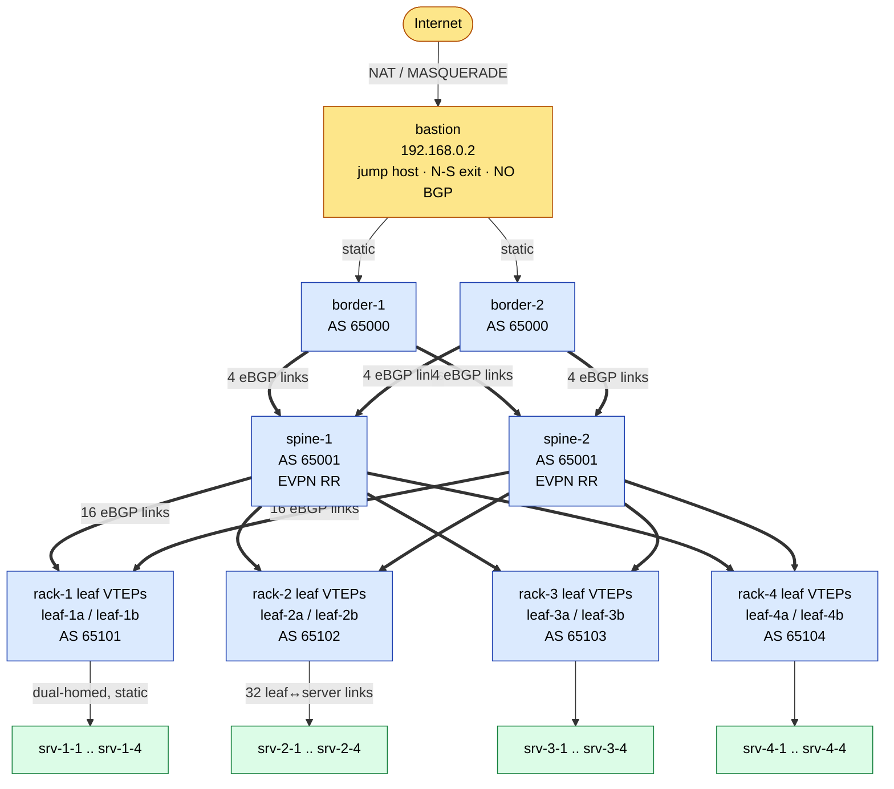

# NetWatch

[](LICENSE)
[](generator/generate.py)
[](https://frrouting.org)

**A single-host emulator of a hyperscale data-center network, built for chaos engineering.**

NetWatch boots 31 KVM virtual machines that form a 3-tier L3 Clos fabric (border, spine, leaf) running **FRR** with an eBGP + BFD underlay and an EVPN/VXLAN overlay that carries real tenant L2 traffic. Same-subnet L2 over VXLAN is validated cross-rack at 0% loss; inter-subnet IRB has a known data-plane limitation on fresh bring-up (see [KNOWN-ISSUES](docs/KNOWN-ISSUES.md)). A Prometheus + Grafana + Loki stack watches all of it. Plain VMs throughout, no Docker and no Kubernetes.

The point of the lab is to break the fabric and watch it heal: drop links, inject latency/loss, partition racks, hard-kill nodes, and measure BGP/BFD reconvergence and end-to-end availability live in Grafana.

> **Single source of truth:** the entire fabric is described in [`topology.yml`](topology.yml). A Python generator renders every FRR, Prometheus, dnsmasq, and Loki config plus the host wiring scripts from it. Change `topology.yml`, regenerate, get a different fabric. Never hand-edit generated files.

---

## What this demonstrates

- **Network engineering:** eBGP everywhere (6-ASN model, ASN-per-rack), BFD fast failure detection, ECMP (`maximum-paths 8`), EVPN/VXLAN overlay, a distributed anycast gateway, and symmetric IRB.
- **Infrastructure-as-code:** one `topology.yml` source of truth feeds a Jinja2 code-generation pipeline. Every FRR/Prometheus/Loki/dnsmasq config and host wiring script is rendered, never hand-written, and one reproducible golden image backs all 31 VMs.
- **Chaos engineering:** link down/flap, latency and loss injection, full-rack partition, and hard node kill, each with live BGP/BFD reconvergence and availability measurement.
- **Observability:** Prometheus + Grafana + Loki, 8 NOC dashboards, and a custom EVPN textfile-collector metrics exporter.
- **Virtualization:** libvirt/KVM via `vagrant-libvirt`, running all 31 VMs on a single host (~19 GB RAM).

---

## At a glance

| | |
|---|---|
| **VMs** | 31 — 2 border + 2 spine + 8 leaf (12 FRR) + 16 servers + bastion + obs + mgmt |
| **Routing** | FRR 10.x · eBGP everywhere (6-ASN model, ASN-per-rack) · BFD · ECMP (`maximum-paths 8`) |
| **Overlay** | EVPN/VXLAN on the 8 leaf VTEPs carrying real same-subnet L2 traffic (validated cross-rack at 0% loss): 2 tenant L2VNIs (10000/10001) + symmetric L3VNI 10999 in VRF `Tenant-A`, distributed anycast gateway. Additive over the routed underlay (inter-subnet IRB caveat in [KNOWN-ISSUES](docs/KNOWN-ISSUES.md)). |
| **Observability** | Prometheus + Grafana + Loki on the `obs` VM; `frr_exporter` (:9342) + `node_exporter` (:9100) on every node |
| **Image** | One golden Vagrant box `netwatch-golden` (Fedora 44 + everything pre-installed); provisioning only *configures* |
| **Hypervisor** | libvirt / KVM via `vagrant-libvirt`, on the **`qemu:///system`** connection |
| **Footprint** | ~19 GB RAM with all 31 VMs up; FRR VMs are 256 MB, servers 768 MB, obs/mgmt 2 GB |
| **libvirt domains** | `NetWatch-main_<node>` — names derive from the clone directory's basename; clone into `NetWatch-main` (or rename accordingly) to match the examples below |

---

## Topology



> Each server is **dual-homed to both leaves in its rack** (ECMP, static routes, no BGP). Heavy arrows (`==>`) are eBGP sessions; thin arrows (`-->`) are static. Link-group totals: **4** border↔spine, **16** spine↔leaf, **32** leaf↔server.

<details>
<summary>ASCII fallback</summary>

```
                              ┌──────────┐
                              │ Internet │
                              └────┬─────┘
                                   │  NAT (MASQUERADE)
                              ┌────┴────┐
                              │ bastion │  192.168.0.2   jump host · N-S exit
                              └──┬───┬──┘                static routes, NO BGP
                  172.16.0.0/30 │   │ 172.16.0.4/30
                         ┌──────┘   └──────┐
                   ┌─────┴────┐       ┌────┴─────┐
       AS 65000    │ border-1 │       │ border-2 │     static default ─► bastion
                   └──┬────┬──┘       └──┬────┬──┘
                      │    └─────┐  ┌────┘    │          4 border↔spine links
                      │    ┌─────┼──┘         │
                ┌─────┴────┴┐   ┌┴────────────┴┐
    AS 65001    │  spine-1  │   │   spine-2    │        EVPN route-reflectors
                └─┬┬┬┬┬┬┬┬──┘   └──┬┬┬┬┬┬┬┬────┘
                  ││││││││         ││││││││             each spine ─► all 8 leafs
                  └┴┴┴┴┴┴┴┴─ 16 spine↔leaf links ─┴┴┴┴┴┘
        ┌───────────────┬───────────────┬───────────────┐
   ┌────┴────┐     ┌────┴────┐     ┌────┴────┐     ┌────┴────┐
   │ leaf-1a │     │ leaf-2a │     │ leaf-3a │     │ leaf-4a │   leaf VTEPs
   │ leaf-1b │     │ leaf-2b │     │ leaf-3b │     │ leaf-4b │   AS 651xx / rack
   └────┬────┘     └────┬────┘     └────┬────┘     └────┬────┘
     rack-1          rack-2          rack-3          rack-4
   srv-1-1..4      srv-2-1..4      srv-3-1..4      srv-4-1..4     32 leaf↔server links
   (each server dual-homed to BOTH leafs in its rack — ECMP, static routes, NO BGP)
```

</details>

- **54 point-to-point links** total (2 border↔bastion + 4 border↔spine + 16 spine↔leaf + 32 leaf↔server), each backed by one host Linux bridge (`br000`–`br053`).
- **20 eBGP sessions** (4 border↔spine + 16 spine↔leaf). Border↔bastion and leaf↔server are **static**, not BGP.
- A separate **management network** (`netwatch-mgmt`, `192.168.0.0/24`) gives every VM out-of-band SSH/DHCP/DNS, isolated from the routed fabric.

**EVPN overlay (real L2, additive).** On top of the routed underlay, the 8 leaf VTEPs run MP-BGP `l2vpn evpn` (spines are the EVPN route-reflectors, borders stay out of it) and carry two tenant L2 segments:

| Tenant | L2VNI | Subnet | Anycast GW | Member servers (overlay NIC) |
|---|---|---|---|---|
| tenant-a | 10000 | `10.99.0.0/24` | `10.99.0.1` | srv-1-1, srv-2-1, srv-3-1, srv-4-1 (`tnt0`) |
| tenant-b | 10001 | `10.99.1.0/24` | `10.99.1.1` | srv-4-1 (`tnt1`) |

A distributed anycast gateway (identical SVI IP+MAC `00:00:5e:00:01:99` on every leaf) plus a symmetric IRB L3VNI 10999 in VRF `Tenant-A` provide same-subnet bridging and, by design, inter-VNI routing over VXLAN. Members attach a dedicated overlay access NIC (`tnt0`/`tnt1`, MTU 1450) into per-tenant host bridges (`br-ovl-*`). The underlay `/30` ECMP fabric is untouched.

Same-subnet L2 over VXLAN is validated on the running fabric. Cross-rack L2 (e.g. `srv-1-1` `10.99.0.11` to `srv-2-1`/`srv-3-1`) runs at 0% loss, with ARP resolving to the peer server's real NIC MAC across VXLAN and remote MACs learned on the L2VNI. The routed underlay stays intact alongside it: cross-rack loopback ping and ECMP are unaffected, and `10.99.0.0/16` is never injected into the underlay (`CONNECTED-FILTER`).

The inter-subnet symmetric IRB control plane is built and verified, but inter-subnet forwarding through the anycast gateway does not reliably work on a fresh bring-up. See [docs/KNOWN-ISSUES.md](docs/KNOWN-ISSUES.md) for the full analysis, and [Observability](#observability--dashboards) and [docs/ARCHITECTURE.md](docs/ARCHITECTURE.md).

See [docs/ARCHITECTURE.md](docs/ARCHITECTURE.md) for the addressing plan, ASN model, forwarding paths, and the config-generation pipeline.

---

## Repository layout

```
topology.yml              SINGLE SOURCE OF TRUTH — nodes, links, ASNs, addressing, timers
Vagrantfile               31 VM definitions + provisioners (authoritative runtime spec)
Makefile                  the entire operator interface (`make help`)

generator/
  generate.py             reads topology.yml → renders all configs + 5 fabric scripts
  templates/              Jinja2 templates (frr/, prometheus/, loki/, dnsmasq/, scripts/)

generated/                ► GENERATED — do not hand-edit
  frr/<node>/             per-node frr.conf, daemons, vtysh.conf, udev rules
  prometheus/  loki/  dnsmasq/  grafana/

scripts/
  fabric/                 host-side bring-up & in-guest wiring
                          (setup-bridges/-frr-links/-server-links/status/teardown are GENERATED;
                           configure-*, setup-evpn, configure-evpn-vtep,
                           configure-overlay-if, evpn-metrics-collector are hand-maintained)
  chaos/                  link-down/-flap, latency, loss, rack-partition, node-kill + lib.sh
  bastion/                setup-ops (aliases/SSH), apply-dnat
  artifacts/              build.sh (download), serve.sh (local HTTP repo)
  bake-golden-image.sh    builds netwatch-golden.box (Fedora + FRR pinned via versions.env)
  provision-obs.sh        configures the observability stack on the obs VM
  provision-extras.sh     optional post-boot dev tooling
  nuke.sh                 nuclear fabric reset (keeps VMs)

config/bastion-dnat.conf  port-forwards exposed on the bastion (Grafana/Prometheus/Loki)
artifacts/                versions.env (pinned versions) + boxes/ + rpms/ + binaries/
validation/monitor.sh     HTTP availability poller for chaos runs
docs/                     ARCHITECTURE.md · RUNBOOK.md · KNOWN-ISSUES.md
```

---

## Prerequisites

- **Host:** Linux with KVM (developed on Fedora, kernel 7.x).
- **libvirt / QEMU-KVM** with the **`qemu:///system`** connection usable by your user, and `virsh`.
- **Vagrant** + **`vagrant-libvirt`** plugin.
- **Python 3** with `pyyaml` and `jinja2` (for `make generate`).
- **~19 GB free RAM** for the full lab, plus several GB disk for VM images and the 1.5 GB golden box.
- **`sudo`** (host bridge creation, nft/iptables rules, host routes).
- **Docker note:** if Docker is installed on the host its default `FORWARD DROP` policy blocks inter-VM bridge traffic. `make up` runs a `hostfix` step that inserts `nft` ACCEPT rules for all `virbr*` bridges to work around this.

---

## Quickstart

### First-time build (once)

```bash
make artifacts-build     # download Fedora box, RPMs, exporter/Prometheus/Grafana/Loki binaries (internet + Docker)
make artifacts-serve     # start local HTTP repo on :8080 (VMs install from this, offline)
make bake                # build the golden image  → artifacts/boxes/netwatch-golden.box (~1.5 GB)
make box-register        # register it with Vagrant as "netwatch-golden"
make generate            # render all configs from topology.yml into generated/
```

### Bring the lab up

```bash
make vms                 # boot all 31 VMs in order: obs → mgmt → 12 FRR → bastion → 16 servers (~3-4 min)
make up                  # wire the fabric: hostfix → bridges → fabric → evpn → wire → routes → overlay → status
```

`make up` is idempotent and ends with a 31-check health report. Allow ~30 s after it finishes for BGP (keepalive/hold 30/90 s) to fully converge. The `overlay` step runs **after** `wire` on purpose: it binds the leaf overlay access ports and finalizes the anycast-IRB datapath once the servers' `tnt0`/`tnt1` NICs exist.

### Look at it

```bash
make status              # re-run the health check any time
make dashboard           # SSH tunnel Grafana :3000 / Prometheus :9090 / Loki :3100 from the obs VM
# ...or reach them via the bastion's forwarded ports: http://192.168.0.2:3000 (Grafana)
vagrant ssh bastion      # operator jump host: `bgp`, `bfd`, `fabric-status`, `routes` aliases
```

### Break it (chaos)

```bash
make chaos-link-down ARGS="spine-1 leaf-1a"          # drop a link  (restore: chaos-link-up)
make chaos-latency   ARGS="spine-1 leaf-1a --delay 200ms"
make chaos-loss      ARGS="spine-1 leaf-1a --loss 30%"
make chaos-flap      ARGS="spine-1 leaf-1a --interval 5 --count 5"
make chaos-partition ARGS="rack-1"                   # isolate a whole rack
make chaos-kill      ARGS="spine-1"                  # hard power-off a node (restore: --restore)
```

Run `validation/monitor.sh <target-ip>` in another terminal during a chaos run to measure availability and the longest outage window.

### Pause / tear down

```bash
make vms-halt            # graceful shutdown, preserves disks
make suspend / resume    # save / restore full RAM state
make down                # graceful fabric teardown (halts FRR VMs, removes bridges)
make nuke                # nuclear reset of fabric wiring, keeps all VMs
make vms-destroy         # delete all 31 VMs
```

Full operational detail, troubleshooting, and the chaos cookbook are in [docs/RUNBOOK.md](docs/RUNBOOK.md).

---

## Command reference

Run `make help` for the live list. Highlights:

| Target | What it does |
|---|---|
| `generate` | Regenerate all configs + fabric scripts from `topology.yml` |
| `vms` / `vms-halt` / `vms-destroy` | Boot (ordered) / halt / destroy all VMs |
| `suspend` / `resume` | Save / restore full VM state to disk |
| `up` | Full fabric bring-up (`hostfix bridges fabric evpn wire routes overlay status`) |
| `bridges` `fabric` `evpn` `wire` `routes` `overlay` | Individual bring-up steps, in order (`overlay` finalizes the EVPN L2 datapath after servers are wired) |
| `status` / `routes` | Health check / add host route to the fabric via bastion |
| `down` / `nuke` | Graceful teardown / nuclear fabric reset |
| `frr-up` / `frr-down` / `frr-restart` | Operate only the 12 FRR VMs |
| `dashboard` | SSH tunnel to Grafana/Prometheus/Loki on `obs` |
| `bastion-ops` / `bastion-dnat` | Configure the bastion as an ops desk / refresh DNAT |
| `chaos-*` | Chaos scenarios (take `ARGS="..."`) |
| `artifacts-build/-serve/-stop/-status` · `bake` · `box-register` | Build pipeline |

---

## Addressing summary

| Plane | CIDR | Notes |
|---|---|---|
| **Loopbacks** | `10.0.0.0/16` | router-ID + scrape target. border `10.0.1.x`, spine `10.0.2.x`, leaf `10.0.3.x`, rack servers `10.0.4.x`–`10.0.7.x`. Advertised into BGP. |
| **Fabric P2P** | `172.16.0.0/16` | `/30` per link. border-bastion `.0`, border-spine `.1`, spine-leaf `.2`, leaf-server racks `.3`–`.6`. Connected/redistributed only. |
| **Management** | `192.168.0.0/24` | OOB, isolated from the fabric. host `.1`, bastion `.2`, mgmt `.3`, obs `.4`, borders `.10-.11`, spines `.20-.21`, leafs `.30-.37`, servers `.50-.65`. |
| **Overlay (EVPN)** | `10.99.0.0/16` | Tenant L2 segments over VXLAN. tenant-a `10.99.0.0/24` (GW `.1`), tenant-b `10.99.1.0/24` (GW `.1`). Distributed anycast gateway; kept out of the underlay by `CONNECTED-FILTER`. |

---

## Observability & dashboards

> **Dashboard screenshots pending capture.** The 8 NOC dashboards render live once the lab is up (`make vms && make up`, then Grafana on the `obs` VM). To add them: capture the panels and drop the PNGs into [`docs/screenshots/`](docs/screenshots/), then uncomment the embeds below.

<!-- Uncomment once the PNGs are captured into docs/screenshots/:


-->

The full stack runs on the **`obs`** VM (`192.168.0.4`):

- **Prometheus** (`:9090`) scrapes `frr_exporter` (`:9342`) on the 12 FRR switches and `node_exporter` (`:9100`) on the other 19 nodes (16 servers + bastion + obs + mgmt), 15 s interval. Each leaf also publishes EVPN metrics (VNI count, EVPN peers/routes, remote VTEPs, and per-VNI local/remote MAC + ARP counts) via a `node_exporter` textfile collector.
- **Loki** (`:3100`) ingests syslog forwarded from every node; query in Grafana via LogQL.
- **Grafana** (`:3000`) is the front end, provisioned with stable datasource UIDs (`netwatch-prometheus`, `netwatch-loki`) and **8 NOC dashboards** that load on the `obs` VM:
  - **`noc-overview`**: top-level fabric health, fabric up/total, alerts at a glance
  - **`fabric-overview`**: per-node BGP/BFD/interface state across the Clos
  - **`bgp-status`**: session state, prefix counts, and message rates
  - **`node-detail`**: per-node CPU/memory/interface drill-down
  - **`interface-counters`**: link throughput, errors, and drops
  - **`chaos-events`**: outage windows and reconvergence during chaos runs
  - **`evpn-vxlan`**: VNI/peer/remote-VTEP counts and `netwatch_evpn_mac_remote` (the L2 data-path proof)
  - **`netwatch-smoke`**: target/exporter health, fabric up/total, FRR BGP message rates, recent Loki logs

  The dashboards are **source** under `generator/templates/grafana/dashboards/*.json`; `make generate` copies them into `generated/grafana/dashboards/` (printing `[Grafana] 8 dashboards`) so generated files are never hand-edited.
- **Access:** `make dashboard` (SSH tunnel from obs), or the bastion's DNAT ports (`config/bastion-dnat.conf`: 3000/9090/3100 → `192.168.0.4`) at `http://192.168.0.2:<port>`.

---

## Documentation

- **[docs/ARCHITECTURE.md](docs/ARCHITECTURE.md)** — design philosophy, ASN/addressing model, control & data plane, EVPN, the generation pipeline, observability.
- **[docs/RUNBOOK.md](docs/RUNBOOK.md)** — full setup, lifecycle, dashboards, the chaos cookbook, troubleshooting, and the regenerate workflow.
- **[docs/KNOWN-ISSUES.md](docs/KNOWN-ISSUES.md)** — known issues, status, and the one open data-plane limitation.
